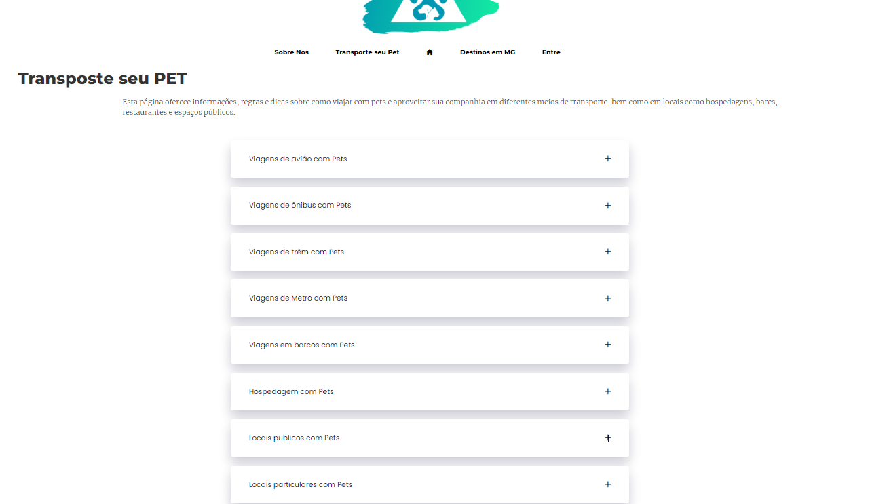
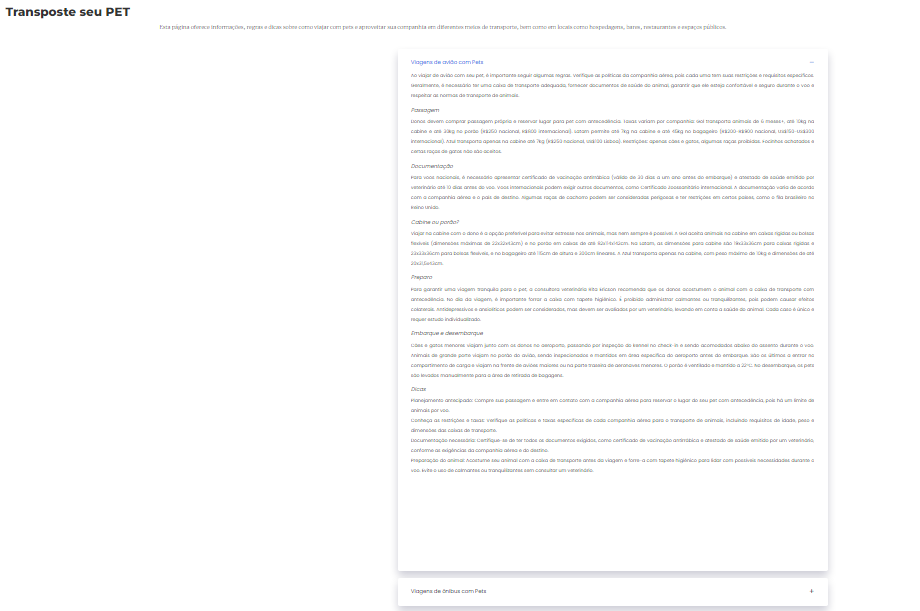

# Programação de Funcionalidades
Nesta seção, você encontrará informações sobre os artefatos e estruturas de dados desenvolvidos para cumprir os requisitos estabelecidos nas Especificações do Projeto. Também fornecemos instruções para acessar e verificar a implementação. As tecnologias empregadas incluem as linguagens HTML, CSS e JavaScript.
## Informações 

## Requisitos Atendidos

### Requisitos Funcionais

|ID    | Descrição do Requisito | Prioridade | Artefato Criado |
|------|------------------------|------------|-----------------|
|RF-001| Disponibilizar área com informações com regras de viagem de avião com pet | ALTA | transporte.html| 
|RF-002| Disponibilizar área com informações com regras de viagem de ônibus com pet | ALTA | transporte.html| 
|RF-003| Disponibilizar área com informações com regras de viagem de carro com pet | ALTA | transporte.html|   
|RF-004| Disponibilizar área com informações de hospedagens *pet friendly* em Minas Gerais | ALTA | transporte.html|   
|RF-005| Disponibilizar área com informações de estabelecimentos comerciais privados *pet friendly* em Minas Gerais | ALTA | transporte.html|  
|RF-006| Disponibilizar área com informações de locais públicos *pet friendly* em Minas Gerais | ALTA | transporte.html|  

Para atender aos requisitos RF-001, RF-001, RF-002, RF-003, RF-004, RF-005 e RF-006 foi desenvolvido a página Transporte.
Ao acessar a página Transporte, será exibo seções descrevendo os informações e dicas de viagens e estabelecimentos *pet friendly*.

Esta página HTML contém seções que fornecem informações e dicas úteis sobre como viajar com pets. Também inclui detalhes sobre vários tipos de acomodações e estabelecimentos relacionados.

## Descrição das estruturas:

## Notícia
|  **Nome**      | **Tipo**          | **Descrição**                             | **Exemplo**                                    |
|:--------------:|-------------------|-------------------------------------------|------------------------------------------------|
| Id             | Numero (Inteiro)  | Identificador único da notícia            | 1                                              |
| Título         | Texto             | Título da notícia                         | Sistemas de Informação PUC Minas é o melhor                                   |
| Conteúdo       | Texto             | Conteúdo da notícia                       | Sistemas de Informação da PUC Minas é eleito o melhor curso do Brasil                            |
| Id do usuário  | Numero (Inteiro)  | Identificador do usuário autor da notícia | 1                                              |

